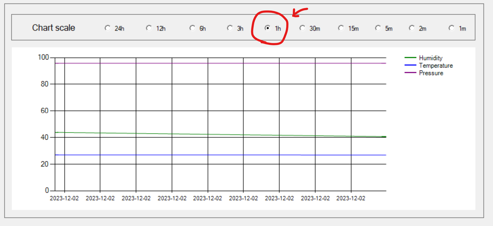

# MeteoStationApp v2.0

  

 
 

## Start here

The "Meteo Station" app is designed to work on Windows with Arduino based MeteoStation.\
It collects meteo data from a COM port and stores the data on disk in a database.\
The app also shows the most recent readings and can display historical data via customizable chart.

### How to use the app

0. Prerequisites:
    >You need to have Arduino based meteo station connected to your pc via usb or bluetooth.\
    >It should send data to a COM port.
    >
    > 
    >
    >You can find out the port number in Windows Device manages, or try all the ports one by one.
    >
    > 

1. Run the MeteoStation.exe
    > to run the app you need to execure MeteoStation.exe file

2. Select a COM port from the drop down list
    >

3. Press "Start data collection" button

    > If the port is correct and the data collection works correct the status change to "Collecting Data".\
    >Otherwise an error notification with error description will pop up.
    >
    > 

4. To stop data collection press Stop button.
    > 
5. Change Scale

    > You can choose chart scale by picking a proper radio button.\
    By default the chart scale equals 1 hour.
    >
    >
